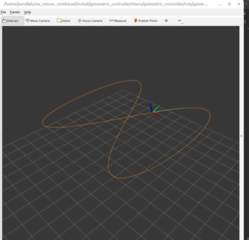
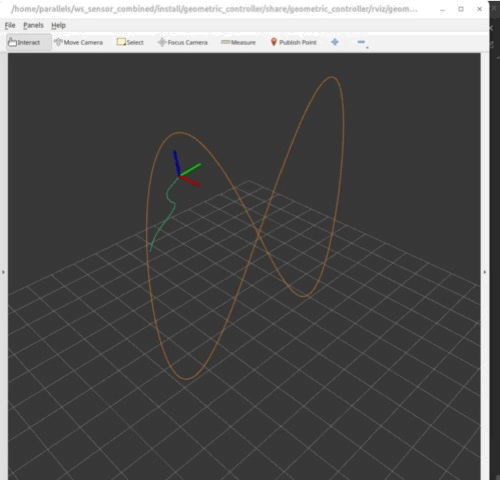

# geometric_controller

**English** | [简体中文](README.zh-CN.md)

`geometric_controller` is a PX4–ROS 2 trajectory-tracking control package for
aerial vehicles. It provides analytic reference generation, geometric control,
incremental nonlinear dynamic inversion (INDI), and PX4 Offboard operation.
ROS computes collective thrust and body-moment commands; PX4 performs control
allocation and actuator output.

The controller structure and reference trajectories follow the open-source
[`UAV_Algorithm_Benchmark`](https://github.com/mengchaoheng/UAV_Algorithm_Benchmark)
project.

## Flight demonstrations

<table>
  <tr>
    <th>Horizontal figure-eight</th>
    <th>Vertical figure-eight</th>
  </tr>
  <tr>
    <td></td>
    <td></td>
  </tr>
  <tr>
    <th>Sinusoidal flip</th>
    <th>Fast circular trajectory</th>
  </tr>
  <tr>
    <td></td>
    <td></td>
  </tr>
</table>

## Controllers

The package provides:

1. `main_geometric` [[1, 3]](#reference-implementations-and-literature)
2. `main_lee` [[2]](#reference-implementations-and-literature)
3. `main_johnson` [[3]](#reference-implementations-and-literature)
4. `main_sun_dfbc` [[4]](#reference-implementations-and-literature)
5. `main_geometric_indi` [[1, 3, 4, 5]](#reference-implementations-and-literature)
6. `px4_direct` [[6]](#reference-implementations-and-literature)

For `main_geometric_indi`, [1] defines the specific implementation, [4]
supports its angular-reference construction, and [5] provides the INDI and
differential-flatness control basis.
Controllers using the SO(3) Log attitude error adopt the full-angle definition
from [3]. Its numerical evaluation uses the canonical-quaternion principal
branch implemented by PX4 `AttitudeControl` [6], with [7, 8] supporting the
small-angle and near-180-degree treatment. `main_sun_dfbc` retains the
tilt-prioritized structure of [4] and uses the same canonical-quaternion
fallback at the antiparallel-thrust-axis singularity.

Modes 1–5 perform trajectory, attitude, and angular-rate control in ROS and
publish collective-thrust and body-moment commands to PX4. PX4 retains control
allocation and actuator output. `px4_direct` publishes position references and
uses the built-in PX4 controller cascade.

The default is `main_geometric_indi`, with outer-loop acceleration INDI and
inner-loop angular-acceleration INDI enabled. `main_geometric` corresponds to
`geometric_pd / controllerGeometricPD` in the open-source MATLAB
implementation, while `main_geometric_indi` corresponds to
`controllerGeometricINDI`. They use different desired-attitude derivative
constructions. Disabling an INDI switch in mode 5 bypasses only the associated
incremental law and preserves its reference-attitude and angular-motion
generation method.

## Geometric INDI

Geometric INDI consists of an outer-loop acceleration INDI and an inner-loop
angular-acceleration INDI:

```text
a_c = a_r + Kp(p_r - p) + Kv(v_r - v)
F_c = F_0 - m(a_c - a_0)

alpha_c = KR Log(R^T R_c) + KOmega(omega_r - omega) + alpha_r
tau_c = tau_0 + J(alpha_c - alpha_0)
```

The desired attitude is constructed from the commanded thrust direction and
reference heading. Reference angular velocity and acceleration are generated
from higher-order trajectory derivatives using the Sun method.

### Outer-loop acceleration INDI

- `a_0` is obtained from `VehicleLocalPosition` and processed by a ROS two-pole
  low-pass filter.
- `F_0` is obtained from `AllocationValue.allocated_force`. PX4 has already
  applied `CA_FORCE_CUTOFF`, so ROS does not filter it again.
- `indi_acceleration_cutoff_hz` sets the acceleration-feedback cutoff.
- `indi_force_delay_s` selects or interpolates `F_0` on the PX4 HRT time base.

`VehicleLocalPosition.timestamp_sample` and `AllocationValue.timestamp` share
the PX4 HRT clock, so force-delay compensation does not use ROS receipt time.
The defaults are:

```yaml
indi_acceleration_cutoff_hz: 8.0
indi_force_delay_s: 0.0
```

### Inner-loop angular-acceleration INDI

- `omega` uses `VehicleAngularVelocity.xyz` directly.
- `alpha_0` uses `VehicleAngularVelocity.xyz_derivative` directly.
- `tau_0` uses `AllocationValue.allocated_torque` directly.

ROS adds no inner-loop angular-feedback filter or delay. Feedback bandwidth is
determined by PX4 `IMU_GYRO_CUTOFF`, `IMU_DGYRO_CUTOFF`, and
`CA_TORQ_CUTOFF`.

### INDI switches and initialization

`indi_acceleration_enabled` and `indi_rate_enabled` are independent. Disabling
one replaces the corresponding incremental law with direct model inversion.
Before the first valid `AllocationValue`, the controller computes an initial
thrust and moment directly; enabled INDI loops engage once allocation feedback
is established.

### PCA moment prioritization

With inner-loop angular-acceleration INDI enabled, ROS publishes both the total moment and the INDI
feedback component:

```text
tau_feedback = tau_0 - J alpha_0
tau_c = J alpha_c + tau_feedback
```

ROS preserves and transmits this decomposition but does not enable PCA. PX4
selects its use from the airframe, allocation matrices, and `CA_METHOD`. The df4
PCA configuration can consume the priority component; the iris WLS
configuration uses only the total moment.

## Command normalization

Collective thrust and body moments are normalized before publication to PX4:

```text
T_n = normalizedthrust_constant * T / mass
tau_n = diag(normalizedtorque_constant_r,
             normalizedtorque_constant_p,
             normalizedtorque_constant_y) tau
```

with

```text
normalizedthrust_constant = mass / T_max = MPC_THR_HOVER / g
```

The iris mass, inertia, and normalization parameters are stored in
[config/vehicles/iris.yaml](config/vehicles/iris.yaml). These parameters must
remain consistent with the PX4 allocation model when changing airframes.

## Reference trajectories and control rates

The package includes horizontal and vertical figure eights, helical flips,
a sinusoidal flip, and a circular trajectory. References provide position,
velocity, acceleration, jerk, snap, and heading derivatives and can be modified
from the tuning panel or through ROS parameters.

Control execution is driven by PX4 feedback. `VehicleAngularVelocity` triggers
inner-loop control and command publication; `VehicleLocalPosition` triggers the
outer-loop acceleration INDI update. The resulting control rates follow the actual state
feedback rates rather than separate rate parameters. Read measured rates with:

```bash
ros2 topic echo /controller/control_rate_status --once
```

PX4 DDS should publish `vehicle_angular_velocity`, `vehicle_attitude`,
`vehicle_local_position`, and `allocation_value` at their source rates.

## Installation

Validated environment: Ubuntu 24.04, ROS 2 Jazzy, PX4 v1.18, and
`px4_msgs release/1.18`.

### PX4

```bash
cd ~
git clone --branch df-main --single-branch \
  https://github.com/mengchaoheng/DuctedFanUAV-Autopilot.git PX4-Autopilot
cd ~/PX4-Autopilot
make px4_sitl
```

### px4_msgs

The project uses extended `AllocationValue` and `VehicleTorqueSetpoint`
messages:

```bash
cd ~/ws_sensor_combined/src
git clone --branch release/1.18 --single-branch \
  https://github.com/PX4/px4_msgs.git
git -C px4_msgs checkout 598c7aad7b2386f9406ebd2a2f841619fddc3c78
git -C px4_msgs apply \
  ../geometric_controller/patches/px4_msgs-release-1.18.patch
```

Message fields and ordering must match PX4 `df-main`.

### Build

```bash
cd ~/ws_sensor_combined
source /opt/ros/jazzy/setup.bash
colcon build --packages-up-to geometric_controller
source install/setup.bash
```

## Launch

Two launch methods are supported.

### Method 1: one-command launch

```bash
cd ~/ws_sensor_combined
source /opt/ros/jazzy/setup.bash
source install/setup.bash
ros2 launch geometric_controller sitl_geometric_controller.launch.py
```

This starts PX4 SITL, Micro XRCE-DDS Agent, the controller, RViz, and the tuning
panel.

### Method 2: three terminals

Terminal 1, start PX4 SITL:

```bash
cd ~/PX4-Autopilot
make px4_sitl gz_iris
```

Terminal 2, start Micro XRCE-DDS Agent:

```bash
MicroXRCEAgent udp4 -p 8888
```

Terminal 3, start this package:

```bash
cd ~/ws_sensor_combined
source /opt/ros/jazzy/setup.bash
source install/setup.bash
ros2 launch geometric_controller geometric_controller.launch.py
```

## Configuration

- [config/controller.yaml](config/controller.yaml): controller, INDI,
  trajectory, Offboard, and visualization parameters;
- [config/vehicles/iris.yaml](config/vehicles/iris.yaml): vehicle dynamics and
  command-normalization parameters.

Controllers, trajectories, and INDI switches can be changed from the tuning
panel or with ROS parameters:

```bash
ros2 param set /trajectory_offboard_node controller_type 5
ros2 param set /trajectory_offboard_node indi_rate_enabled true
ros2 param set /trajectory_offboard_node indi_acceleration_enabled true
```

## Reference implementations and literature

1. C. Meng, [`UAV_Algorithm_Benchmark`](https://github.com/mengchaoheng/UAV_Algorithm_Benchmark),
   open-source flight-control project.
2. T. Lee, M. Leok, and N. H. McClamroch, “Geometric Tracking Control of a
   Quadrotor UAV on SE(3),” *49th IEEE Conference on Decision and Control*,
   pp. 5420–5425, 2010. [doi:10.1109/CDC.2010.5717652](https://doi.org/10.1109/CDC.2010.5717652)
3. J. C. Johnson and R. W. Beard, “Globally-Attractive Logarithmic Geometric
   Control of a Quadrotor for Aggressive Trajectory Tracking,” *IEEE Control
   Systems Letters*, 2022.
   [doi:10.1109/LCSYS.2022.3141066](https://doi.org/10.1109/LCSYS.2022.3141066)
4. S. Sun, A. Romero, P. Foehn, E. Kaufmann, and D. Scaramuzza, “A Comparative
   Study of Nonlinear MPC and Differential-Flatness-Based Control for Quadrotor
   Agile Flight,” *IEEE Transactions on Robotics*, vol. 38, pp. 3357–3373,
   2022. [doi:10.1109/TRO.2022.3177279](https://doi.org/10.1109/TRO.2022.3177279)
5. E. Tal and S. Karaman, “Accurate Tracking of Aggressive Quadrotor
   Trajectories Using Incremental Nonlinear Dynamic Inversion and Differential
   Flatness,” *IEEE Transactions on Control Systems Technology*, vol. 29,
   no. 3, pp. 1203–1218, 2021.
   [doi:10.1109/TCST.2020.3001117](https://doi.org/10.1109/TCST.2020.3001117)
6. L. Meier and The PX4 Contributors, [`PX4 Autopilot`](https://github.com/PX4/PX4-Autopilot),
   Zenodo. [doi:10.5281/zenodo.595432](https://doi.org/10.5281/zenodo.595432)
7. J. Solà, “Quaternion Kinematics for the Error-State Kalman Filter,” 2017.
   [doi:10.48550/arXiv.1711.02508](https://doi.org/10.48550/arXiv.1711.02508)
8. Z. Nurlanov, “Exploring SO(3) Logarithmic Map: Degeneracies and
   Derivatives,” 2021. [PDF](https://nurlanov.me/static/uploads/nurlanov2021so3log.pdf)

The PX4 firmware implementation used by this project is
[`DuctedFanUAV-Autopilot: df-main`](https://github.com/mengchaoheng/DuctedFanUAV-Autopilot/tree/df-main).
